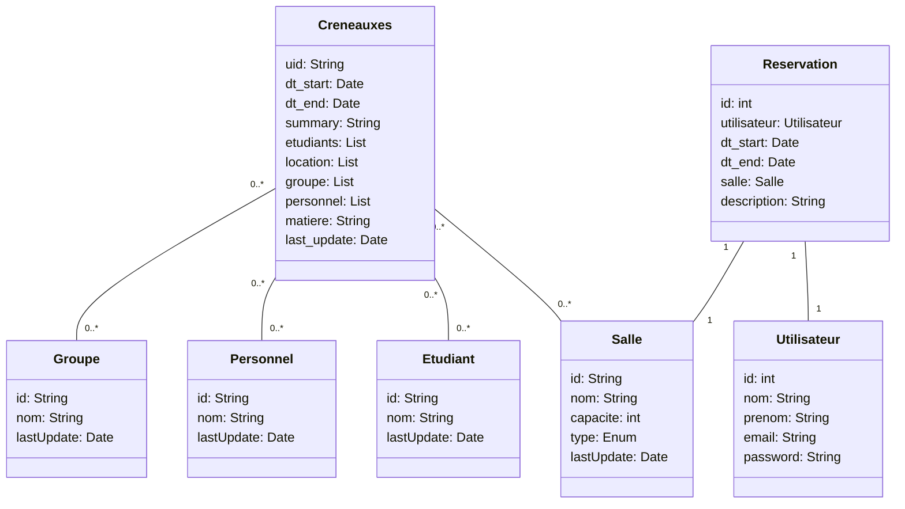

# Gus Metal - Server

Projet de Web Server - LP MiAR

L'API permet de lier une ville à ses données météo. La documentation [Swagger](https://meteo.gugustinette.com/documentation) permet de voir les différentes routes disponibles.
Avant d'utiliser les routes d'accès aux données, il faut s'authentifier. 2 routes sont disponibles pour cela :
- `POST /auth/register` : permet de s'enregistrer
- `POST /auth/authenticate` : permet de se connecter
Les 2 routes renvoient un token JWT qui doit être utilisé comme `Bearer` dans les requêtes suivantes.

## Conception

Diagramme UML du modèle de l'application (avec Mermaid) :


Last update (si last update dépasse 1 jour entier --> suppression du truc)

## Lancement du projet

Installer le projet
```bash
./mvnw clean install -Dmaven.test.skip=true
```

Lancer le projet
```bash
./scripts/run.sh
```

Lancer le projet en mode dev (avec hot reload)
```bash
./scripts/runDev.sh
```

Pour lancer les tests
```bash
./mvnw test -Dspring.profiles.active=test
```

## Documentation OpenAPI

L'API est documentée avec OpenAPI (via Swagger). Pour accéder à la documentation, il suffit de lancer le projet et d'aller sur l'URL suivante : http://localhost:8080/documentation ou http://localhost:8070/documentation (via Docker)

## Distribution
Pour build le war
```bash
./mvnw package
```

Ensuite, on peut lancer le war avec la commande suivante
```bash
java -jar target/td1-0.0.1-SNAPSHOT.war
```

## Déploiement
Le déploiement se fait via Docker :
```
docker compose up --build -d
```

La première fois, la configuration réseau Nginx peut être déployé via le script `deployNginxConfig.sh` :
```
./scripts/deployNginxConfig.sh
```

Il faut ensuite utiliser `Certbot` pour générer les certificats SSL :
```
sudo apt install certbot
sudo certbot --nginx -d meteo.gugustinette.com
```

### Sources de données

Météo : https://public.opendatasoft.com/explore/dataset/donnees-synop-essentielles-omm/table/?sort=date
Ville : https://public.opendatasoft.com/explore/dataset/communes-urbaines-et-rurales-france-millesime/table/
